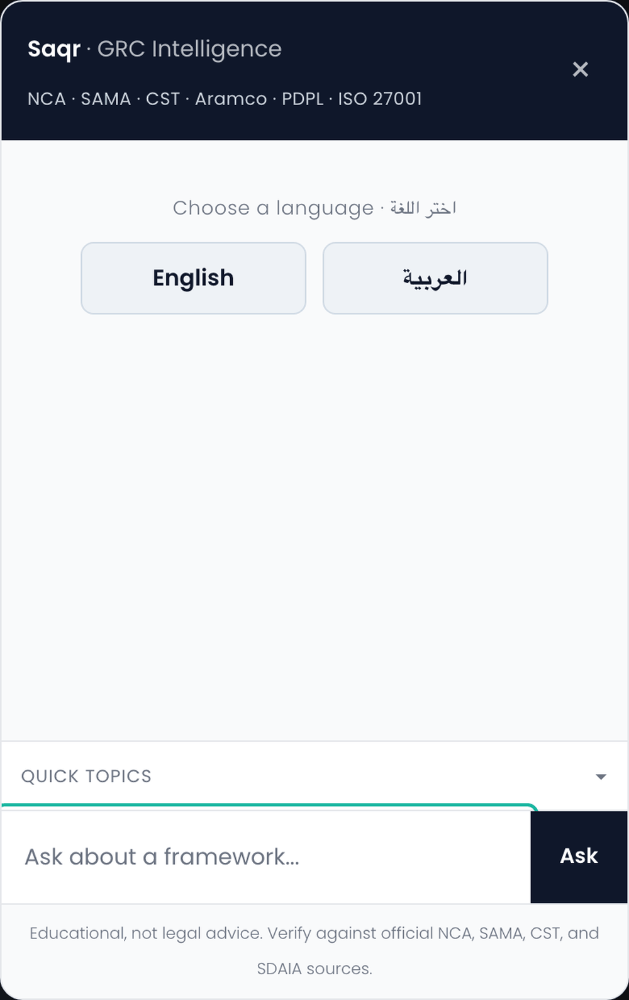
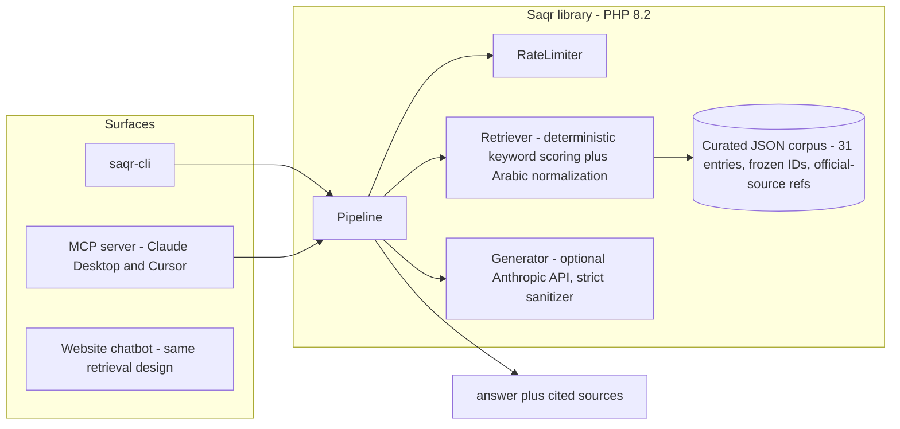
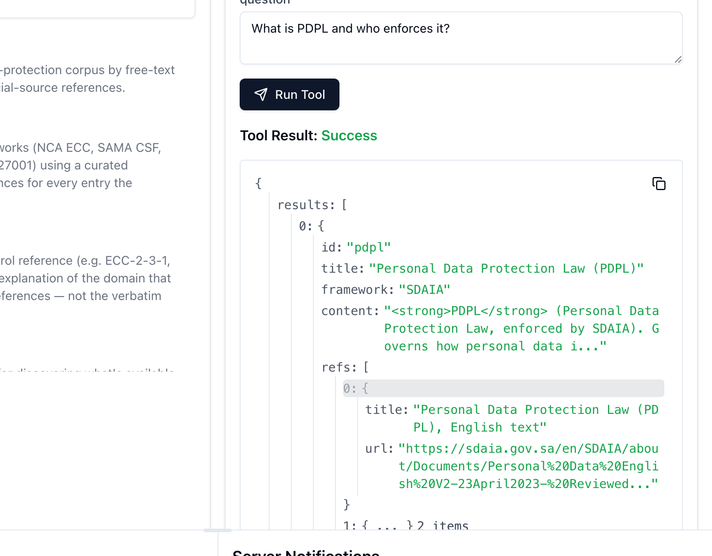

# Saqr

[](https://github.com/cybersafe-lab/saqr/actions/workflows/ci.yml)


[](LICENSE)

**Grounded retrieval-augmented Q&A library for Saudi Arabia's cybersecurity and data-protection frameworks.**

Saqr (Arabic: *صقر*, "falcon") answers questions about Saudi cybersecurity and data-protection regimes: **NCA** (ECC, CCC, CSCC, DCC, TCC, OSMACC, SCyWF), **SAMA** (CSF, ITGF, BCM), **CST** (CRF), **Aramco** (SACS-210), **SDAIA** (PDPL), and **ISO 27001**. It uses a curated practitioner corpus, deterministic keyword retrieval, and (optionally) an LLM for fluent answer synthesis.

The corpus is plain JSON. The retriever is plain PHP. The optional generator is a thin Anthropic Messages API caller. **No vendor lock-in, no embeddings service, no database.**



---

## How it works



Retrieval is deterministic: keywords are scored by byte length, which weights
Arabic terms above their Latin equivalents, and the same input always produces
the same ranking. Every answer carries the ids of the entries it was built from
and their official-source refs (empty only for the two self-description entries,
which cite nothing), so any factual claim can be traced to a regulator
publication. The LLM layer is optional. With no API key configured, Saqr returns
the top-ranked curated entry verbatim rather than degrading to a guess. (The
website chatbot in the diagram is a separate WordPress deployment that
reimplements this retrieval design; it does not consume the library.)

1. **Corpus**: a JSON file of 31 practitioner-written entries. Each has an `id`
   (frozen in `corpus/ids.lock`), a `title` (the label clients print above the
   answer), a `category`, a `framework` label, a list of `keywords` (English and
   transliterated terms), an `answer`, and `refs`: the official document title
   and URL behind it.
2. **Retriever**: lowercase the question, expand any Arabic phrases to their
   English keyword equivalents, then score each corpus entry by summing the byte
   lengths of its keywords that appear in the question. Return the top 3 by
   score. No embeddings; deterministic and explainable.
3. **Generator** (optional): if `SAQR_ANTHROPIC_KEY` (or `ANTHROPIC_API_KEY`) is
   set, the top entries are passed to Claude Haiku as `[SOURCE 1]…[SOURCE N]`
   context with a strict grounding system prompt. The model returns sanitized
   HTML using only `<strong>`, `<em>`, `<br>`; anything else is unwrapped and
   re-escaped. If no key is set, the retriever returns the top entry verbatim.
4. **Rate limiter**: a `RateLimiterInterface` is composed into `Pipeline`. The
   bundled `InMemoryRateLimiter` is fine for CLI and single-process use; plug in
   Redis or any other backend for production.

---

## Engineering highlights

- **Test rigor:** 122 Pest tests, 387 assertions, across Unit, Characterization
  (pins the byte-level Arabic ranking semantics that a reimplementation in
  another language would silently drift on), Snapshot (ranking regression),
  Integration (CLI JSON contract), Smoke, and Eval suites, plus 29 vitest tests
  for the MCP server. CI runs every suite: the unit through eval suites on PHP
  8.2 and 8.3, the Integration suite on 8.3, the MCP suite on Node 20 and 22. One
  test, a WordPress handler smoke, skips unless `SAQR_WP_PATH` points at a local
  install.
- **Grounded by construction:** answers are assembled from a curated,
  frozen-ID corpus; every answer-bearing response carries the entries it was
  retrieved from and their official regulator references.
- **Bilingual evaluation:** 106 retrieval eval cases (66 English, 40 Arabic)
  with per-language hit@1 / hit@3 / MRR and a committed overall baseline that CI
  refuses to regress.
- **Corpus as code:** `php bin/corpus-lint` runs in CI and enforces the entry
  schema, frozen IDs, a title and framework label on every entry, at least one
  official-source ref on every non-META entry, the `{title, url}` shape of each
  ref, brand-voice style rules (no em-dashes or en-dashes, no puff words), and a
  prompt-injection blocklist. Both run on every string an entry sends to a
  client: the answer, the entry title, and each ref title. Ref URLs carry the
  injection blocklist as well, but not the style rules, since a URL is the
  publisher's string and not ours to reword. A separate `php bin/refs-check`
  confirms every ref URL still resolves, including a per-host soft-404 guard for `nca.gov.sa` and
  `cst.gov.sa`, which answer HTTP 200 for paths that do not exist. It hits the
  network, so it runs at curation time rather than in CI.
- **No infra:** plain JSON and plain PHP; no embeddings service, no vector DB,
  no framework.

---

## Use Saqr from Claude Desktop / Cursor (MCP)

Saqr ships an MCP server so any MCP-compatible AI client can query the corpus as tools.

### Option A: via npm (requires PHP 8.2+ on the host)

Add to your `claude_desktop_config.json`:

```jsonc
{
  "mcpServers": {
    "saqr": {
      "command": "npx",
      "args": ["-y", "saqr-mcp"],
      "env": { "ANTHROPIC_API_KEY": "sk-ant-..." }
    }
  }
}
```

### Option B: via Docker (no PHP required)

```jsonc
{
  "mcpServers": {
    "saqr": {
      "command": "docker",
      "args": [
        "run", "-i", "--rm",
        "-e", "ANTHROPIC_API_KEY",
        "ghcr.io/cybersafe-lab/saqr-mcp:latest"
      ]
    }
  }
}
```

Verify the Docker image's signature (optional):

```bash
cosign verify ghcr.io/cybersafe-lab/saqr-mcp:latest \
  --certificate-identity-regexp 'https://github.com/cybersafe-lab/saqr/.*' \
  --certificate-oidc-issuer 'https://token.actions.githubusercontent.com'
```

Tools: `saqr_search`, `saqr_compare_frameworks`, `saqr_explain_control`, `saqr_show_corpus`.

All three answer-bearing tools return official sources next to the answer, as a
`refs` array of `{title, url}` objects:

| Tool | What `refs` holds |
|---|---|
| `saqr_search` | the refs of each returned entry, per result |
| `saqr_explain_control` | the refs of the entry that answered the lookup |
| `saqr_compare_frameworks` | the refs behind the answer returned: the union across every entry a synthesized comparison drew on, deduplicated by URL, or just the refs of the single entry served verbatim when no API key is configured |

`refs` is always present. It is empty for exactly two entries: the META
self-descriptions (`about-assistant`, `frameworks-index`), which describe the
assistant rather than a framework and so have nothing to cite. Those two are
also the entries that answer what new users open with ("help", "what frameworks
do you cover"), so an empty `refs` is a normal first response, not an edge case. Read `refs[0]` defensively.



See `docs/mcp.md` for the full integration guide.

---

## Quickstart

The package is not on Packagist yet, so install it straight from GitHub:

```bash
composer config repositories.saqr vcs https://github.com/cybersafe-lab/saqr
composer require cybersafe-lab/saqr:dev-main
```

```php
<?php
require 'vendor/autoload.php';

$corpus   = \Saqr\Corpus::loadFromFile(__DIR__ . '/corpus/frameworks.json');
$pipeline = new \Saqr\Pipeline($corpus);

$result = $pipeline->ask('What is NCA ECC?');
echo $result['answer'];
```

CLI demo (no setup beyond `composer install`):

```bash
php examples/cli.php "What is NCA ECC?"
php examples/cli.php "ما هو نظام حماية البيانات الشخصية؟"
```

---

## Coverage

| Authority | Frameworks in corpus |
|---|---|
| **NCA** | ECC, CCC, CSCC, DCC, TCC, OSMACC, SCyWF |
| **SAMA** | CSF, ITGF, BCM |
| **CST** | CRF |
| **Saudi Aramco** | SACS-210 / CCC (contractor) |
| **SDAIA** | PDPL |
| **International** | ISO 27001 |
| **Cross-framework** | Comparisons (ECC↔ISO, ECC↔CCC, SAMA↔NCA, PDPL↔DCC, Aramco↔NCA) |
| **Practitioner advice** | Where to start, maturity, audit, third-party |

**SACS-210** is the number Aramco's CCC program cites today. **SACS-002** is the
designation suppliers historically encountered, and many still hear it in the
market; Aramco states nowhere that one replaced the other, so neither does Saqr.
Both designations retrieve the same entry, which tells you to check which number
your contract and your audit firm actually cite.

The corpus is **curated practitioner notes**, not regulator-issued text. It
encodes one practitioner's read of the frameworks. **Always verify critical
decisions against the official regulator publication**, which is what the `refs`
on every framework entry are for.

---

## Configuration

| Option | Where | Default |
|---|---|---|
| Anthropic API key | env `SAQR_ANTHROPIC_KEY` or `ANTHROPIC_API_KEY`, or `Generator` constructor arg | none (corpus-only fallback) |
| Model | `Generator` constructor `$model` | `claude-haiku-4-5` |
| Max tokens | `Generator` constructor `$maxTokens` | `500` |
| Per-client hourly cap | `Pipeline` constructor `$perClientHourlyCap` | `20` |
| Global daily cap | `Pipeline` constructor `$globalDailyCap` | `2000` |
| Rate-limiter backend | `Pipeline` constructor `$rateLimiter` | `InMemoryRateLimiter` |

---

## Requirements

- PHP **8.2** or newer (tested on 8.2, 8.3)
- ext-json (always available)
- ext-mbstring (for Arabic text handling)
- ext-curl (for the optional Anthropic call)
- Node **20** or newer, for the MCP server only (tested on 20, 22)

---

## Project layout

```
saqr/
├── src/
│   ├── Corpus.php
│   ├── Retriever.php
│   ├── GeneratorInterface.php
│   ├── Generator.php
│   ├── Pipeline.php
│   ├── Eval/Metrics.php
│   ├── Exception/InvalidCorpusException.php
│   ├── RateLimiter/
│   │   ├── RateLimiterInterface.php
│   │   └── InMemoryRateLimiter.php
│   └── Util/StderrScrubber.php
├── corpus/
│   ├── frameworks.json
│   ├── ids.lock
│   └── style-bans.txt
├── bin/
│   ├── saqr-cli          # JSON-over-stdio contract the MCP server speaks
│   ├── serve.php         # long-lived mode: one corpus load, many requests
│   ├── once.php          # one-shot mode: positional args to one result
│   ├── dispatcher.php    # cmd -> result shapes
│   ├── autoload.php      # PSR-4 fallback for the npm channel (no Composer)
│   ├── corpus-lint       # schema, frozen IDs, title, refs, style, injection
│   ├── refs-check        # ref URL reachability (network, run manually)
│   └── saqr-eval         # regenerates the retrieval eval report
├── mcp/                  # TypeScript MCP server (npm + Docker)
├── eval/
│   ├── questions.jsonl
│   └── baseline.json
├── tests/                # Unit, Characterization, Snapshot, Integration, Smoke, Eval
├── examples/
│   └── cli.php
└── .github/workflows/ci.yml
```

---

## Why a curated corpus, not RAG-over-PDFs?

Saudi cybersecurity regulator documents are short, dense, and easily misread by general-purpose embeddings, especially the cross-framework relationships ("ECC and CCC overlap here," "PDPL and DCC do data classification differently"). Embedding-search will give you the right paragraph for the wrong question.

A curated, practitioner-written corpus is **higher precision** for the same effort:

- Every entry was written by someone who has actually advised a Saudi client on that framework.
- Keywords are picked by someone who knows what visitors ask (including the Arabic phrasings).
- Cross-framework comparisons are first-class entries, not artifacts of paragraph adjacency.
- The corpus is **inspectable**. Anyone reviewing the repo can see exactly what Saqr knows, and every framework entry names the official document it came from.

If you need RAG-over-PDFs, build that. Saqr is a different design point.

---

## Evaluation

Retrieval quality is measured on every PR against a labeled question set
(`eval/questions.jsonl`), using the same `Retriever` production serves. The
runner reports hit@1, hit@3, and MRR, overall and per language, and CI fails if
any headline metric regresses below `eval/baseline.json`.

| Scope | hit@1 | hit@3 | MRR | n |
|-------|-------|-------|-----|---|
| Overall | 0.953 | 0.972 | 0.962 | 106 |
| en | 0.955 | 0.985 | 0.970 | 66 |
| ar | 0.950 | 0.950 | 0.950 | 40 |

Read the `ar` figure for what it is: corpus keywords are English, so an Arabic
question only retrieves when `Retriever::normalizeArabic` recognizes one of its
phrasings, which makes 0.950 a measure of alias coverage over the phrasings in
this set rather than open-domain Arabic understanding. The five known misses and
the three Arabic substring traps behind them are written up in
[docs/eval.md](docs/eval.md). Regenerate the report locally with
`php bin/saqr-eval`.

---

## Contributing

PRs welcome, especially:

- Additional corpus entries (with `refs` to the regulator publication)
- Framework integrations under `examples/` (Laravel, Symfony, Slim, plain PSR-15)
- Translations / bilingual README
- Rate-limiter implementations (Redis, Memcached, APCu)

Please:

- Keep corpus entries **practitioner-voiced**, not vendor-marketing-voiced.
- Cite the regulator publication for any factual claim about control counts, dates, or versions.
- Run `composer lint` (PHP `-l` on all `src/*.php`) before submitting.
- Run `php bin/corpus-lint` before submitting corpus changes. New entries need a `framework` label and at least one `refs` item; see `CONTRIBUTING.md`.

---

## Security

Report security issues to **security@malyahya.com**. Coordinated disclosure preferred; please give a reasonable window before publishing.

---

## License

Apache-2.0, see [LICENSE](LICENSE).

Copyright 2026 Mohammed AlYahya.
