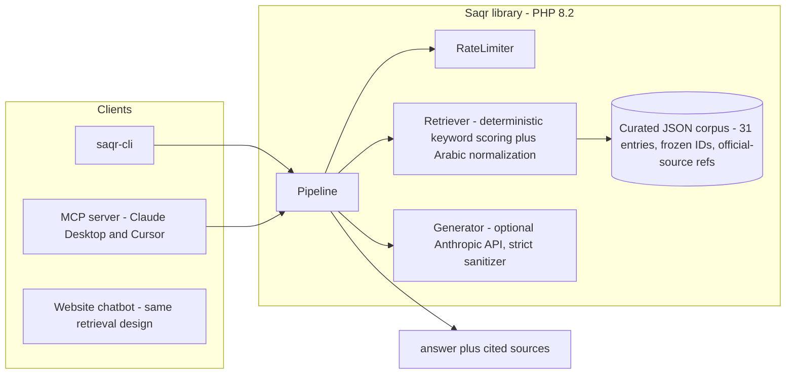

# Saqr LinkedIn Showcase Sprint Implementation Plan

> **For agentic workers:** REQUIRED SUB-SKILL: Use superpowers:subagent-driven-development (recommended) or superpowers:executing-plans to implement this plan task-by-task. Steps use checkbox (`- [ ]`) syntax for tracking.

**Goal:** Make Saqr LinkedIn-Featured-card worthy: chatbot answers display official-source citations, Arabic eval coverage grows 8 → ≥40 cases, the repo README showcases the architecture, and the live case study page tells the engineering story — per `docs/superpowers/specs/2026-07-29-linkedin-showcase-design.md`.

**Architecture:** The library corpus gains `refs` (official regulator doc title + URL) and populated `framework` fields, plumbed through `Corpus` → `Pipeline::ask()['top']` → MCP dispatcher. The live WP chatbot (an independent implementation at `/Volumes/SSD/public_html/wp-content/themes/mefolio-child/inc/grc-assistant.php`, REST route `lab/v1/grc`) gains entry `id`s + `refs` in its hardcoded KB, an additive `sources` array in the REST response, and a DOM-built sources row in the chat UI. A newly discovered factual error (CCC/CSCC acronym swap in the corpus) is fixed first.

**Tech Stack:** PHP 8.2+ (Pest tests), Node 20+ (MCP server, vitest), WordPress child theme (live site), GitHub Actions CI.

## Global Constraints

- PHP `>=8.2`, Node `>=20` (from `composer.json` / `mcp/package.json` engines).
- Corpus entry IDs are **frozen** (`corpus/ids.lock`): never rename or remove; new ids get appended to the lock.
- Corpus answers: **no em-dashes** (`—`), no words in `corpus/style-bans.txt`, no strings from the prompt-injection blocklist (`bin/corpus-lint` enforces all three).
- Corpus/WP-KB HTML: only `<strong>`, `<em>`, `<br>` in answers (sanitizers strip everything else).
- **No fabricated URLs.** Every `refs` URL must be verified reachable (`HTTP 200` after redirects) at authoring time and point to the official regulator/publisher domain.
- WP REST contract is **additive only**: existing `{answer, source}` keys keep their exact semantics; rate-limit branches keep returning `{answer}` only; client JS must tolerate a missing `sources` key.
- Every commit leaves the full suite green: `vendor/bin/pest` (97+ tests), `php bin/corpus-lint`, and (when `mcp/` changed) `cd mcp && npx vitest run`.
- `eval/baseline.json` is never auto-lowered; baseline changes are their own deliberate commit with the new numbers in the message.
- Repo commit style: conventional prefixes (`feat:`, `fix:`, `docs:`, `chore:`, `eval:`). End commit messages with:
  `Co-Authored-By: Claude Fable 5 <noreply@anthropic.com>`
- Production (Hostinger) changes: take a timestamped backup on the server before overwriting any file, purge LiteSpeed cache after deploy, verify live in a browser. **Do not deploy without explicit user go-ahead in the session.**
- All repo work happens in `/Volumes/SSD/Code/saqr-v0.2`. WP work edits the local tree `/Volumes/SSD/public_html/...` and is deployed by Task 10 only.

---

### Task 1: Fix the CCC/CSCC acronym swap (corpus + Arabic aliases + evals)

The corpus mislabels two NCA frameworks. Officially: **CSCC = Critical Systems Cybersecurity Controls (2019)**, **CCC = Cloud Cybersecurity Controls (2020)**. The corpus has the content swapped: entry `nca-ccc` describes critical systems, `nca-cscc` describes cloud, and `ecc-vs-ccc` inherits the error. `src/Retriever.php`'s Arabic alias map is consistent with the swap (so retrieval "works" today) and must be corrected together with the content. IDs are frozen, so we swap **content**, not ids.

**Files:**
- Modify: `corpus/frameworks.json` (entries `nca-ccc`, `nca-cscc`, `ecc-vs-ccc`; add entry `ecc-vs-cscc`)
- Modify: `corpus/ids.lock` (append `ecc-vs-cscc`)
- Modify: `src/Retriever.php:92-93` (Arabic alias map)
- Modify: `eval/questions.jsonl:20-22` (flip expectations), append 2 cases for `ecc-vs-cscc`
- Modify: `eval/baseline.json` (rerun), `tests/Snapshot/__snapshots__/*` (rankings change)
- Test: `tests/Unit/RetrieverTest.php` (new cases)

**Interfaces:**
- Consumes: existing `Retriever::retrieveTopK(string $question, int $k = 3): array` (returns entry arrays with `id`).
- Produces: corrected corpus semantics every later task builds on — `nca-ccc` = cloud, `nca-cscc` = critical systems. Task 3 curates refs against these corrected meanings.

- [ ] **Step 1: Write failing retrieval tests pinning the correct semantics**

Append to `tests/Unit/RetrieverTest.php`:

```php
test('Arabic critical-systems phrase retrieves nca-cscc (official acronym)', function () {
    $corpus = Corpus::loadFromFile(__DIR__ . '/../../corpus/frameworks.json');
    $r = new Retriever($corpus);
    $ids = array_column($r->retrieveTopK('ما هي ضوابط الأنظمة الحساسة؟', 3), 'id');
    expect($ids[0])->toBe('nca-cscc');
});

test('cloud cybersecurity controls question retrieves nca-ccc (official acronym)', function () {
    $corpus = Corpus::loadFromFile(__DIR__ . '/../../corpus/frameworks.json');
    $r = new Retriever($corpus);
    $ids = array_column($r->retrieveTopK('What are the NCA cloud cybersecurity controls?', 3), 'id');
    expect($ids[0])->toBe('nca-ccc');
});
```

Match the file's existing imports/use statements (open it first; other tests there construct `Corpus`/`Retriever` the same way).

- [ ] **Step 2: Run and verify both fail**

Run: `cd /Volumes/SSD/Code/saqr-v0.2 && vendor/bin/pest tests/Unit/RetrieverTest.php`
Expected: the two new tests FAIL (top id is the swapped one).

- [ ] **Step 3: Swap corpus content**

In `corpus/frameworks.json`:

1. `nca-ccc` and `nca-cscc`: swap the two entries' `answer` bodies AND thematic keywords, keeping each **id and its acronym keyword** in place. End state:
   - `nca-ccc`: keywords `["nca ccc", "cloud cybersecurity controls", "nca cloud", "cloud controls saudi", "csp controls"]`; answer = the current `nca-cscc` cloud text with its leading tag corrected to `<strong>NCA CCC</strong> (Cloud Cybersecurity Controls, issued 2020).` (body text unchanged otherwise; scan the whole body for any other `CSCC` token and correct it to `CCC`).
   - `nca-cscc`: keywords `["cscc", "critical systems cybersecurity", "critical systems controls", "critical national infrastructure", "cni controls"]`; answer = the current `nca-ccc` critical-systems text with its leading tag corrected to `<strong>NCA CSCC</strong> (Critical Systems Cybersecurity Controls, issued 2019).` (scan body for stray `CCC` tokens likewise).
2. Rewrite `ecc-vs-ccc` to be a *correct* ECC-vs-CCC (cloud) comparison:

```json
"answer": "<strong>NCA ECC vs NCA CCC:</strong> ECC is the <em>baseline</em> every in-scope entity must meet. CCC is a <em>layered set for cloud computing</em>: it applies to cloud service providers operating in Saudi Arabia and to cloud tenants, tiered by data classification. If you consume or provide cloud services in scope, CCC applies on top of ECC, it does not replace it. Map both into one control catalog so cloud controls extend the baseline instead of forking it."
```

3. Add a new entry `ecc-vs-cscc` (append to `entries` and append the id to `corpus/ids.lock`):

```json
{
  "id": "ecc-vs-cscc",
  "category": "COMPARISONS",
  "keywords": ["ecc vs cscc", "cscc vs ecc", "difference ecc cscc", "baseline vs critical systems", "ecc and cscc"],
  "answer": "<strong>NCA ECC vs NCA CSCC:</strong> ECC is the <em>baseline</em> every in-scope entity must meet. CSCC is a <em>layered, stricter set</em> for critical systems and critical national infrastructure. If you are in scope of CSCC, you are automatically in scope of ECC. Treat CSCC as the ceiling and ECC as the floor, and build one unified control catalog that satisfies both at once, tagged per source framework."
}
```

(Adapted from the old `ecc-vs-ccc` text; note the em-dash-free, banned-word-free phrasing must survive `corpus-lint`.)

- [ ] **Step 4: Fix the Arabic alias map**

In `src/Retriever.php` replace lines 92-93:

```php
            'ضوابط الأنظمة الحساسة'           => 'cscc critical systems controls',
            'ضوابط الحوسبة السحابية'          => 'nca ccc cloud cybersecurity controls',
```

(The alias strings must contain the corrected entries' keywords as substrings: `cscc` + `critical systems controls` hit `nca-cscc`; `nca ccc` + `cloud cybersecurity controls` hit `nca-ccc`.)

- [ ] **Step 5: Fix eval expectations that pinned the swap**

In `eval/questions.jsonl`:
- Line 20 (`critical national infrastructure`): `"expected_ids": ["nca-cscc"]`, update note.
- Line 21 (`NCA cloud cybersecurity controls`): `"expected_ids": ["nca-ccc"]`, update note.
- Line 22: the question itself embeds the error; replace the line with:

```json
{"q": "What does CSCC require for critical systems in Saudi Arabia?", "lang": "en", "expected_ids": ["nca-cscc"], "note": "matches 'cscc' and 'critical systems controls'"}
```

- Append two cases for the new comparison entry:

```json
{"q": "What is the difference between ECC and CSCC?", "lang": "en", "expected_ids": ["ecc-vs-cscc"], "note": "matches 'ecc vs cscc' / 'difference ecc cscc'"}
{"q": "If I'm subject to CSCC do I also need to comply with ECC?", "lang": "en", "expected_ids": ["ecc-vs-cscc"], "note": "matches 'cscc vs ecc' / 'ecc and cscc'"}
```

- [ ] **Step 6: Run the suite; update snapshots deliberately**

Run: `php bin/corpus-lint && vendor/bin/pest`
Expected: Step 1 tests now PASS. `tests/Snapshot/RankingSnapshotTest.php` may fail because rankings legitimately changed — inspect the diff, confirm every changed ranking is explained by the swap, then delete the stale snapshot files under `tests/Snapshot/__snapshots__/` and rerun to regenerate. `tests/Eval/RetrievalEvalTest.php` must pass (metrics should not regress; if a metric *improves*, leave the baseline alone here — Task 4 rebaselines once).

- [ ] **Step 7: Regenerate eval baseline only if the gate fails upward**

If (and only if) `RetrievalEvalTest` fails, run `php bin/saqr-eval`, inspect, and update `eval/baseline.json` to the new (equal-or-better) numbers.

- [ ] **Step 8: Commit**

```bash
git add corpus/frameworks.json corpus/ids.lock src/Retriever.php eval/questions.jsonl tests/
git commit -m "fix(corpus): CCC/CSCC acronyms were swapped; align content, aliases, evals"
```

---

### Task 2: Corpus `refs` + `framework` plumbing in `Corpus.php` (TDD)

**Files:**
- Modify: `src/Corpus.php:69-76` (normalization) and its docblocks (`:11-26`, `:30`, `:34`, `:83`)
- Test: `tests/Unit/CorpusTest.php`

**Interfaces:**
- Consumes: nothing new.
- Produces: every entry from `Corpus::all()` / `Retriever::retrieveTopK()` / `Pipeline::ask()['top']` now includes `'refs' => array<int, array{title: string, url: string}>` (default `[]`). Tasks 3, 5, and the MCP task rely on this exact key + shape.

- [ ] **Step 1: Write failing tests**

Append to `tests/Unit/CorpusTest.php` (match its existing fixture style — it writes temp JSON files; open the file first and reuse its helper pattern):

```php
test('loadFromFile preserves well-formed refs and defaults to empty array', function () {
    $path = tempnam(sys_get_temp_dir(), 'saqr');
    file_put_contents($path, json_encode(['entries' => [
        ['keywords' => ['a'], 'answer' => 'x',
         'refs' => [['title' => 'NCA ECC', 'url' => 'https://nca.gov.sa/x']]],
        ['keywords' => ['b'], 'answer' => 'y'],
    ]]));
    $entries = Corpus::loadFromFile($path)->all();
    expect($entries[0]['refs'])->toBe([['title' => 'NCA ECC', 'url' => 'https://nca.gov.sa/x']]);
    expect($entries[1]['refs'])->toBe([]);
    unlink($path);
});

test('loadFromFile drops malformed ref items', function () {
    $path = tempnam(sys_get_temp_dir(), 'saqr');
    file_put_contents($path, json_encode(['entries' => [
        ['keywords' => ['a'], 'answer' => 'x', 'refs' => [
            ['title' => 'ok', 'url' => 'https://example.gov.sa/d'],
            ['title' => 'no url'],
            'not-an-object',
        ]],
    ]]));
    $entries = Corpus::loadFromFile($path)->all();
    expect($entries[0]['refs'])->toBe([['title' => 'ok', 'url' => 'https://example.gov.sa/d']]);
    unlink($path);
});
```

- [ ] **Step 2: Run to verify failure**

Run: `vendor/bin/pest tests/Unit/CorpusTest.php`
Expected: FAIL — `refs` key missing from normalized entries (`toBe([])` gets `null`/undefined key).

- [ ] **Step 3: Implement normalization**

In `src/Corpus.php`, inside the `$clean[] = [...]` block after `'category'`:

```php
                'refs'      => isset($entry['refs']) && is_array($entry['refs'])
                    ? array_values(array_filter(array_map(
                        static fn ($r) => is_array($r)
                            && isset($r['title'], $r['url'])
                            && is_string($r['title']) && is_string($r['url'])
                            ? ['title' => $r['title'], 'url' => $r['url']]
                            : null,
                        $entry['refs']
                    )))
                    : [],
```

Update the three array-shape docblocks in the file (class property, constructor param, `all()`) to include `refs: array<int, array{title: string, url: string}>`, and the file-header "Expected shape" comment. Also fix the stale `@return` docblock on `Retriever::retrieveTopK` (`src/Retriever.php:36`) to the full entry shape `{id: ?string, title: ?string, framework: ?string, category: ?string, keywords: array<int, string>, answer: string, refs: array<int, array{title: string, url: string}>}` while you're plumbing.

- [ ] **Step 4: Run full suite**

Run: `vendor/bin/pest`
Expected: PASS (new key is additive; characterization/snapshot tests compare rankings and specific fields, not whole-array equality — if any test does whole-shape equality, update its expected array to include `'refs' => []` and say so in the commit body).

- [ ] **Step 5: Commit**

```bash
git add src/Corpus.php src/Retriever.php tests/Unit/CorpusTest.php
git commit -m "feat(corpus): plumb refs (official source citations) through Corpus"
```

---

### Task 3: Lint rules + curate `refs`/`framework` for all 31 entries

Data curation and its enforcement are one deliverable: lint rules that fail on the un-curated corpus are this task's "failing test".

**Files:**
- Modify: `bin/corpus-lint` (new rules)
- Modify: `corpus/frameworks.json` (all 31 entries: add `framework` + `refs`)
- Create: `bin/refs-check` (URL reachability script, also used in Step 5)

**Interfaces:**
- Consumes: Task 2's `refs` normalization.
- Produces: fully curated corpus. Later tasks read `framework` (non-empty string) and `refs` (≥1 item for non-META entries) on every entry.

- [ ] **Step 1: Add lint rules (the failing test)**

In `bin/corpus-lint`, after the answer checks inside the entry loop, add:

```php
    // Showcase sprint: framework label + official source refs.
    $fw = $entry['framework'] ?? null;
    if (!is_string($fw) || trim($fw) === '') {
        $fail("Entry '{$id}': missing framework label");
    }

    $refs = $entry['refs'] ?? null;
    if (($entry['category'] ?? '') !== 'META') {
        if (!is_array($refs) || $refs === []) {
            $fail("Entry '{$id}': missing refs (official source citations)");
        }
    }
    foreach (is_array($refs) ? $refs : [] as $j => $ref) {
        if (!is_array($ref) || !isset($ref['title'], $ref['url'])
            || !is_string($ref['title']) || trim($ref['title']) === ''
            || !is_string($ref['url']) || !str_starts_with($ref['url'], 'https://')) {
            $fail("Entry '{$id}': refs[{$j}] must be {title: non-empty, url: https://...}");
        }
    }
```

Update the file-header comment (`:5-12`) to mention the two new rules.

- [ ] **Step 2: Run lint to verify it fails on the real corpus**

Run: `php bin/corpus-lint`
Expected: FAIL with ~31 "missing framework label" + ~29 "missing refs" violations (META entries `about-assistant`, `frameworks-index` are exempt from refs but still need `framework` — give them `framework: "META"`).

- [ ] **Step 3: Curate the data**

For each of the 31 entries add `framework` and `refs`. `framework` values: `NCA`, `SAMA`, `CST`, `SDAIA`, `Aramco`, `ISO`, `META`; comparison entries use the joined pair, e.g. `NCA / ISO`, `SAMA / NCA`, `SDAIA / NCA`, `Aramco / NCA`; practitioner-advice entries (`program-starting-point`, `maturity`, `audit`, `third-party`) use `Cross-framework`.

`refs` format per entry (1-2 items). Two complete examples of the required quality:

```json
"framework": "NCA",
"refs": [
  { "title": "NCA Essential Cybersecurity Controls (ECC-2:2024)",
    "url": "https://nca.gov.sa/en/regulatory-documents" }
]
```

```json
"framework": "SDAIA",
"refs": [
  { "title": "Personal Data Protection Law (PDPL)",
    "url": "https://sdaia.gov.sa/en/SDAIA/about/Pages/RegulationsAndPolicies.aspx" }
]
```

Authoritative starting domains (verify each concrete URL yourself; deep-link to the specific document page where one exists, else the regulator's official document-library page): NCA `https://nca.gov.sa`, SAMA rulebook `https://rulebook.sama.gov.sa`, CST `https://www.cst.gov.sa`, SDAIA `https://sdaia.gov.sa`, Aramco supplier cybersecurity (SACS) via `https://www.aramco.com` supplier pages, ISO `https://www.iso.org/standard/27001`. Comparison entries cite both underlying documents (2 refs). **Never write a URL you have not verified in Step 5.** While editing the `aramco-sacs-002` entry, verify the current program designation (the live site's 2026-07-22 review found suppliers now reference SACS-210) and make the answer name both accurately.

- [ ] **Step 4: Create the URL checker**

Create `bin/refs-check` (mode 755):

```php
#!/usr/bin/env php
<?php
declare(strict_types=1);

// Verifies every refs URL in the corpus answers HTTP < 400 after redirects.
// Network-dependent: run manually at curation time, NOT wired into CI.
$data = json_decode((string) file_get_contents($argv[1] ?? __DIR__ . '/../corpus/frameworks.json'), true);
$fail = 0;
foreach (($data['entries'] ?? []) as $entry) {
    foreach (($entry['refs'] ?? []) as $ref) {
        $ch = curl_init($ref['url']);
        curl_setopt_array($ch, [
            CURLOPT_NOBODY => true, CURLOPT_FOLLOWLOCATION => true,
            CURLOPT_RETURNTRANSFER => true, CURLOPT_TIMEOUT => 15,
            CURLOPT_USERAGENT => 'saqr-refs-check/1.0',
        ]);
        curl_exec($ch);
        $code = (int) curl_getinfo($ch, CURLINFO_RESPONSE_CODE);
        curl_close($ch);
        // Some government sites reject HEAD; retry those with GET before failing.
        if ($code >= 400 || $code === 0) {
            $ch = curl_init($ref['url']);
            curl_setopt_array($ch, [
                CURLOPT_FOLLOWLOCATION => true, CURLOPT_RETURNTRANSFER => true,
                CURLOPT_TIMEOUT => 20, CURLOPT_USERAGENT => 'saqr-refs-check/1.0',
            ]);
            curl_exec($ch);
            $code = (int) curl_getinfo($ch, CURLINFO_RESPONSE_CODE);
            curl_close($ch);
        }
        $ok = $code > 0 && $code < 400;
        printf("%s %-14s %s (%d)\n", $ok ? 'OK  ' : 'FAIL', $entry['id'], $ref['url'], $code);
        if (!$ok) { $fail++; }
    }
}
exit($fail > 0 ? 1 : 0);
```

- [ ] **Step 5: Verify lint + URLs + suite**

Run: `php bin/corpus-lint && php bin/refs-check && vendor/bin/pest`
Expected: all PASS. Fix any FAIL URL by finding the correct official page (do not delete the ref to silence the check).

- [ ] **Step 6: Commit**

```bash
git add bin/corpus-lint bin/refs-check corpus/frameworks.json
git commit -m "feat(corpus): official-source refs + framework labels on all entries, lint-enforced"
```

---

### Task 4: Arabic eval expansion to ≥40 cases + rebaseline

**Files:**
- Modify: `eval/questions.jsonl` (append ~32 `ar` cases), `eval/baseline.json`, `docs/eval.md`
- Modify (only if alias gaps found): `src/Retriever.php` `normalizeArabic` map
- Test: existing gate `tests/Eval/RetrievalEvalTest.php` (unchanged)

**Interfaces:**
- Consumes: corrected corpus (Task 1). Eval line format: `{"q": "...", "lang": "ar", "expected_ids": ["<id>"], "note": "..."}` — `expected_ids` must exist in the corpus (the gate throws on unknown ids).
- Produces: `eval/baseline.json` with new `n` (≥104) and per-language numbers in `docs/eval.md` that Task 5 (README) and Task 11 (case study) quote.

- [ ] **Step 1: Author the Arabic cases**

Append ~32 `ar` lines to `eval/questions.jsonl` so every one of the 31 corpus ids has at least one Arabic case (8 exist today covering 7 ids). Authoring rules:
- Modern Standard Arabic, natural practitioner phrasing; vary interrogatives (ما هي / ما هو / اشرح / هل), include 3-4 cases *without* the question particle (bare topic, e.g. "ضوابط العمل عن بعد"), 2-3 with Latin acronyms embedded in Arabic text (e.g. "ما الفرق بين ECC و ISO 27001؟"), and both hamza spellings where common (أيزو / ايزو).
- Every `note` states which alias/keyword the case should match, following the existing file's style.

Complete examples of the required quality (include these four verbatim):

```json
{"q": "ما هي ضوابط الأمن السيبراني للحوسبة السحابية في السعودية؟", "lang": "ar", "expected_ids": ["nca-ccc"], "note": "Arabic 'cloud computing cybersecurity controls'; alias 'ضوابط الحوسبة السحابية' → 'nca ccc cloud cybersecurity controls'"}
{"q": "اشرح ضوابط الأنظمة الحساسة", "lang": "ar", "expected_ids": ["nca-cscc"], "note": "bare-topic phrasing; alias 'ضوابط الأنظمة الحساسة' → 'cscc critical systems controls'"}
{"q": "ما هو إطار SACS الخاص بأرامكو للموردين؟", "lang": "ar", "expected_ids": ["aramco-sacs-002"], "note": "alias 'أرامكو' → 'aramco sacs'"}
{"q": "من أين أبدأ برنامج الأمن السيبراني في منشأتي؟", "lang": "ar", "expected_ids": ["program-starting-point"], "note": "alias 'من أين أبدأ' → 'where do i start'"}
```

- [ ] **Step 2: Run the eval and triage misses**

Run: `php bin/saqr-eval`
Expected: per-language block prints `[ar]` with n≥40. For each miss, classify: (a) missing alias in `normalizeArabic` → add the alias (cheap fix, allowed); (b) ambiguous question → sharpen the question; (c) structural retriever weakness → do NOT fix; record it in `docs/eval.md` under a "Known limitations" heading. Re-run until remaining misses are all class (c).

- [ ] **Step 3: Rebaseline deliberately**

Run `php bin/saqr-eval`, copy the OVERALL numbers into `eval/baseline.json` (fields `hit1, hit3, mrr, n`, 4-decimal rounding as produced by the gate's aggregate). Run `vendor/bin/pest` — all green.

- [ ] **Step 4: Update docs/eval.md**

Replace the results table with the new overall + per-language numbers (copy the exact `saqr-eval` output), dated 2026-07-29, and add the "Known limitations" subsection listing class-(c) misses with one-line explanations.

- [ ] **Step 5: Commit**

```bash
git add eval/questions.jsonl eval/baseline.json docs/eval.md src/Retriever.php
git commit -m "eval: expand Arabic coverage 8 -> N cases; rebaseline (hit@1 X.XXX ar / Y.YYY en)"
```

(Fill N/X/Y with the real numbers.)

---

### Task 5: MCP surfaces refs; fix overpromising tool descriptions (TDD)

**Files:**
- Modify: `bin/dispatcher.php:53-62` (search results gain `refs`), `:64-83` (compare/explain sources keep ids; explain gains `refs` of the first hit)
- Modify: `mcp/src/tools.ts:6` and `:15` (descriptions)
- Test: `tests/Unit/DispatcherRefsTest.php` (new), `mcp/` vitest suite
- Rebundle: `mcp/vendor-bundled/` via `cd mcp && node scripts/bundle.mjs`

**Interfaces:**
- Consumes: `Pipeline::ask()['top']` entries with `refs` (Tasks 2-3).
- Produces: `saqr_search` result items shaped `{id, title, framework, content, refs: [{title, url}]}` (the `score` key is REMOVED — it was always null); `explain_control` result gains `refs`. MCP consumers and README (Task 6) document this shape.

- [ ] **Step 1: Write failing PHP test**

Create `tests/Unit/DispatcherRefsTest.php`:

```php
<?php
declare(strict_types=1);

use Saqr\Corpus;
use Saqr\Pipeline;
use Saqr\RateLimiter\InMemoryRateLimiter;

require_once __DIR__ . '/../../bin/dispatcher.php';

test('search results include refs and omit the always-null score', function () {
    $corpus = Corpus::loadFromFile(__DIR__ . '/../../corpus/frameworks.json');
    $pipeline = new Pipeline($corpus, null, new InMemoryRateLimiter());
    $out = saqr_dispatch('search', ['question' => 'What is the NCA ECC?'], $pipeline, $corpus);
    expect($out['results'])->not->toBeEmpty();
    $first = $out['results'][0];
    expect($first)->toHaveKeys(['id', 'title', 'framework', 'content', 'refs'])
        ->and($first)->not->toHaveKey('score')
        ->and($first['refs'][0])->toHaveKeys(['title', 'url']);
});
```

(Check `Pipeline`'s constructor signature in `src/Pipeline.php` first; if the rate limiter or generator params differ, match them. If requiring `bin/dispatcher.php` inside Pest collides with function redeclaration across test files, guard with `if (!function_exists('saqr_dispatch'))`.)

- [ ] **Step 2: Run to verify failure**

Run: `vendor/bin/pest tests/Unit/DispatcherRefsTest.php`
Expected: FAIL (`refs` key missing / `score` present).

- [ ] **Step 3: Implement dispatcher changes**

In `bin/dispatcher.php` `search` case, replace the result mapper:

```php
                'results' => array_map(static fn($t) => [
                    'id' => $t['id'] ?? null,
                    'title' => $t['title'] ?? $t['category'] ?? null,
                    'framework' => $t['framework'] ?? null,
                    'content' => $t['answer'] ?? '',
                    'refs' => $t['refs'] ?? [],
                ], $r['top']),
```

In the `explain_control` case add `'refs' => $first['refs'] ?? [],` after `'summary'`.

- [ ] **Step 4: Fix tool descriptions**

In `mcp/src/tools.ts`: `saqr_search` description → `"Search Saqr's Saudi cybersecurity / data-protection corpus by free-text question. Returns top-3 entries with official-source references."` `saqr_compare_frameworks` description: change `Aramco SACS-002` → `Aramco SACS` (matches corrected corpus wording).

- [ ] **Step 5: Update vitest expectations + rebundle**

Open `mcp/` test files (`grep -rn "score" mcp/src mcp/*.test.* mcp/tests 2>/dev/null` to find shape assertions), update any that expect `score`/miss `refs`. Then:

Run: `cd mcp && node scripts/bundle.mjs && npx vitest run`
Expected: all green (26+ tests). The rebundle refreshes `vendor-bundled/` with the new dispatcher + corpus (STATE.md precedent: forgetting this shipped a stale bundle once — do not skip).

- [ ] **Step 6: Full PHP suite, then commit**

Run: `cd /Volumes/SSD/Code/saqr-v0.2 && vendor/bin/pest`

```bash
git add bin/dispatcher.php mcp/ tests/Unit/DispatcherRefsTest.php
git commit -m "feat(mcp): surface official-source refs in search/explain; drop always-null score"
```

---

### Task 6: README overhaul

**Files:**
- Modify: `README.md`

**Interfaces:**
- Consumes: real numbers from Task 4 (`docs/eval.md`), shapes from Task 5.
- Produces: the README recruiters read. Task 9 (media) inserts images into the placeholders defined here.

- [ ] **Step 1: Add badges + rewrite the architecture section**

Under the `# Saqr` title line add (verify the workflow filename via `ls .github/workflows/`):

```markdown
[](https://github.com/cybersafe-lab/saqr/actions/workflows/ci.yml)


[](LICENSE)
```

Replace the ASCII diagram in "How it works" (`README.md:92-106`) with a mermaid block (GitHub renders it natively — no image build step):



Under it, one short paragraph: retrieval is deterministic (keyword scoring, UTF-8-byte weighting for Arabic), every answer carries the retrieved entries' ids and official-source refs, and the LLM layer is optional — without an API key Saqr returns curated entries verbatim.

- [ ] **Step 2: Add "Engineering highlights" section**

Insert after "How it works" (verify each number against the current suite before writing it — run `vendor/bin/pest | tail -3`):

```markdown
## Engineering highlights

- **Test rigor:** ~110 Pest tests across Unit, Characterization (pins byte-level Arabic
  ranking semantics), Snapshot (ranking regression), Smoke, and Eval suites, plus a
  vitest suite for the MCP server. CI runs them all.
- **Grounded by construction:** answers are assembled from a curated, frozen-ID corpus;
  every response carries the retrieved entries and their official regulator references.
- **Bilingual evaluation:** N retrieval eval cases (En + Ar) with per-language
  hit@1 / hit@3 / MRR and a committed baseline that CI refuses to regress.
- **Corpus as code:** `corpus-lint` enforces schema, frozen IDs, style rules, verified
  official-source refs, and a prompt-injection blocklist on every commit.
- **No infra:** plain JSON + PHP; no embeddings service, no vector DB, no framework.
```

(Replace `~110` and `N` with real counts.)

- [ ] **Step 3: Fix stale claims + document refs**

- "Coverage" (`:113`): update the Aramco line to match the corrected corpus wording from Task 3 (SACS-002 / SACS-210 designation as verified).
- Corpus-shape sentence (`:107` area): entries have `id`, `category`, `framework`, `keywords`, `answer`, and `refs` (official document title + URL).
- "Evaluation" (`:189`): quote the new per-language table from `docs/eval.md`.
- Add media placeholders where Task 9 will drop files: after the intro paragraph `` and in the MCP section `` — commented out with `<!-- -->` until Task 9 uncomments them.

- [ ] **Step 4: Verify rendering + commit**

Run: `grep -n "mermaid" README.md` (block present); view the file rendered (e.g. `gh markdown-preview` if available, else push later and check).

```bash
git add README.md
git commit -m "docs: README overhaul - diagram, badges, engineering highlights, refs"
```

---

### Task 7: WP chatbot KB gains ids + refs; REST response gains `sources`

Work on the local tree `/Volumes/SSD/public_html/wp-content/themes/mefolio-child/inc/grc-assistant.php`. No deploy in this task.

**Files:**
- Modify: `inc/grc-assistant.php` — KB array (`:906-1072`), handler (`:449-572`), query log (`:864-884`)

**Interfaces:**
- Consumes: `ids.lock` ids for alignment; refs curated in Task 3 (reuse the same titles/URLs for matching entries).
- Produces: REST `POST lab/v1/grc` response `{"answer": string, "source": "llm"|"kb"|"none", "sources": [{"id": string, "title": string, "url": string}]}` — `sources` has ≤3 items, one per retrieved entry that has refs (first ref only); rate-limit/short-circuit branches (`:461`, `:518`, `:524`) are untouched and still return `{answer}` only. Task 8's JS consumes exactly this shape.

- [ ] **Step 1: Add `id` + `refs` to all 32 KB entries**

For each entry in `ma_grc_knowledge_base()` add two keys, e.g.:

```php
        array(
            'id'       => 'nca-overview',
            'refs'     => array(
                array( 'title' => 'NCA Regulatory Documents Library', 'url' => 'https://nca.gov.sa/en/regulatory-documents' ),
            ),
            'keywords' => array( 'national cybersecurity authority', 'who is nca', ... ),
            'answer'   => '...',
        ),
```

Alignment rules: where a KB entry covers the same topic as a corpus entry, use the corpus id verbatim (`nca-overview`, `sdaia`, `sama-overview`, `cst`, `nca-ecc`, ...). WP-only entries (OTCC, SACS-210-specific, any others) get new ids in the same `[a-z0-9-]+` style (e.g. `nca-otcc`) — do NOT add them to the repo's `ids.lock`. Reuse Task 3's verified URLs; any WP-only URL must be verified with the same curl procedure before writing it.

- [ ] **Step 2: Build `sources` in the handler**

Add a helper above `ma_grc_assistant_handler`:

```php
/**
 * Map retrieved KB entries to the additive `sources` wire field.
 * One item per entry that carries refs; first ref only. ≤3 items.
 */
function ma_grc_sources_payload( $top_entries ) {
    $out = array();
    foreach ( $top_entries as $entry ) {
        if ( empty( $entry['id'] ) || empty( $entry['refs'][0]['url'] ) ) {
            continue;
        }
        $out[] = array(
            'id'    => $entry['id'],
            'title' => $entry['refs'][0]['title'],
            'url'   => $entry['refs'][0]['url'],
        );
    }
    return $out;
}
```

Then add `'sources' => ma_grc_sources_payload( $top )` to exactly three responses: the global-cap KB return (`:545`), the LLM return (`:553-556`), and the KB fallback (`:562-565`). The no-match return (`:568`) gets `'sources' => array()`. For the LLM return pass all of `$top`; for the two KB-verbatim returns pass `array_slice( $top, 0, 1 )` (only the entry actually shown).

- [ ] **Step 3: Log ids instead of answer prefixes**

In `ma_grc_log_query` replace the `$matched` line (`:873`) with:

```php
    $matched = ! empty( $top_entries )
        ? implode( ',', array_filter( wp_list_pluck( $top_entries, 'id' ) ) )
        : '(no match)';
```

- [ ] **Step 4: Syntax check + contract check**

Run: `php -l /Volumes/SSD/public_html/wp-content/themes/mefolio-child/inc/grc-assistant.php`
Then a standalone contract test (no WP install locally — stub the WP functions):

```bash
php -r '
function wp_list_pluck($l,$k){return array_map(fn($e)=>$e[$k]??null,$l);}
require_once "/Volumes/SSD/public_html/wp-content/themes/mefolio-child/inc/grc-assistant.php";
' 2>&1 | head -5
```

If the require fails on other missing WP functions (add_action etc. run at load), instead extract-and-test: copy `ma_grc_sources_payload` + `ma_grc_knowledge_base` into a scratch file and assert every KB entry has a valid `id` (`preg_match('/^[a-z0-9-]+$/')`), unique across entries, and every `refs[0]['url']` starts with `https://`:

```php
<?php // scratchpad/kb-check.php — paste the two functions above this block
$ids = array();
foreach (ma_grc_knowledge_base() as $i => $e) {
    assert(isset($e['id']) && preg_match('/^[a-z0-9-]+$/', $e['id']), "entry #$i bad id");
    assert(!isset($ids[$e['id']]), "dup id {$e['id']}");
    $ids[$e['id']] = 1;
    assert(!empty($e['refs'][0]['url']) && str_starts_with($e['refs'][0]['url'], 'https://'), "entry {$e['id']} bad ref");
}
$sample = ma_grc_sources_payload(array_slice(ma_grc_knowledge_base(), 0, 3));
assert(count($sample) === 3 && isset($sample[0]['id'], $sample[0]['title'], $sample[0]['url']));
echo "KB OK: " . count($ids) . " entries\n";
```

Run: `php -d zend.assertions=1 -d assert.exception=1 scratchpad/kb-check.php`
Expected: `KB OK: 32 entries`.

- [ ] **Step 5: Record the change (no repo commit — site tree)**

The site tree is deployed by SSH in Task 10. Note the edit in the working dir's STATE.md Done list. If `/Volumes/SSD/public_html` is a git repo (check `git -C /Volumes/SSD/public_html status`), commit there with message `feat(grc): KB ids + refs; additive sources array in REST response`.

---

### Task 8: WP chat UI renders the sources row

**Files:**
- Modify: `inc/grc-assistant.php` — the inline JS (`:340-368` fetch handler, plus new render function near `appendMsg` `:290`) and the inline CSS block (find it: `grep -n "grc-msg" inc/grc-assistant.php | head`)

**Interfaces:**
- Consumes: Task 7's `data.sources` (may be absent — rate-limit branches).
- Produces: visible sources row; screenshot target for Tasks 9 and 11.

- [ ] **Step 1: Add the renderer (DOM API only — never innerHTML for links)**

`sanitizeBotHtml` strips all attributes, so links CANNOT pass through `appendMsg`. Add after `appendMsg`:

```javascript
        function appendSources(sources, msgEl) {
            if (!sources || !sources.length || !msgEl) return;
            var row = document.createElement('div');
            row.className = 'grc-sources';
            row.setAttribute('dir', 'auto');
            var label = document.createElement('span');
            label.className = 'grc-sources-label';
            label.textContent = (currentLang === 'ar') ? 'المصادر:' : 'Sources:';
            row.appendChild(label);
            sources.forEach(function (s) {
                if (!s || typeof s.url !== 'string' || s.url.indexOf('https://') !== 0) return;
                var a = document.createElement('a');
                a.className = 'grc-source-chip';
                a.href = s.url;                    // set via property, never innerHTML
                a.target = '_blank';
                a.rel = 'noopener noreferrer';
                a.textContent = s.title || s.id;
                row.appendChild(a);
            });
            if (row.children.length > 1) msgEl.appendChild(row);
        }
```

- [ ] **Step 2: Wire it into the fetch handler**

`appendMsg` already returns the message element (`:304 return d;`). Change the success branch (`:356-359`) to:

```javascript
            .then(function (data) {
                hideTyping();
                var el = appendMsg(data.answer || 'No answer for that yet. Try a topic below.', 'bot');
                appendSources(data.sources, el);
            })
```

- [ ] **Step 3: Add CSS**

In the theme's chatbot CSS block (same file or `style.css` — follow where `.grc-msg` styles live; check both before choosing), add:

```css
.grc-sources { margin-top: 6px; display: flex; flex-wrap: wrap; gap: 6px; align-items: center; font-size: 12px; }
.grc-sources-label { opacity: .7; }
.grc-source-chip { display: inline-block; padding: 2px 8px; border: 1px solid currentColor; border-radius: 10px; text-decoration: none; opacity: .85; }
.grc-source-chip:hover { opacity: 1; text-decoration: underline; }
```

Match the existing chat panel's colors — inspect the current `.grc-msg.bot` styles and inherit rather than hardcoding new hex values. If styles go in `style.css`, remember it cache-busts on its own mtime (no version bump needed until deploy — STATE.md precedent).

- [ ] **Step 4: Static checks**

Run: `php -l inc/grc-assistant.php`. Then open the page locally if a local WP exists; otherwise verification happens live in Task 10 (the JS is inline PHP-emitted — no build step).

- [ ] **Step 5: Record/commit as in Task 7 Step 5**

Message: `feat(grc): render sources row under bot answers (DOM-built links, RTL-safe)`.

---

### Task 9: Demo media for the README

Do this task AFTER Task 10 (deploy) so the GIF shows the real site with sources. Listed here because its artifacts land in the repo.

**Files:**
- Create: `docs/img/chatbot-sources.gif`, `docs/img/mcp-claude-desktop.png`
- Modify: `README.md` (uncomment the two media embeds from Task 6)

**Interfaces:**
- Consumes: live deployed chatbot (Task 10); README placeholders (Task 6).
- Produces: media referenced by README and reusable by the case study (Task 11).

- [ ] **Step 1: Record the chatbot GIF**

Use the browser tooling available in-session (per user global rules, the gstack `/browse` skill) against the live site: open the chatbot, ask "What is the difference between ECC and CSCC?" then Arabic "ما هي ضوابط الحوسبة السحابية؟", capturing typing → answer → sources row. Target ≤15s, ≤1200px wide, <5 MB (GitHub README limit comfort). If in-session recording can't produce a GIF, capture sequential screenshots and assemble: `ffmpeg -framerate 2 -i frame%02d.png -vf "scale=1000:-1" docs/img/chatbot-sources.gif` (check `which ffmpeg` first; if absent, ask the user to record with macOS screen capture and convert).

- [ ] **Step 2: Capture the MCP screenshot**

Needs the user's Claude Desktop with the saqr MCP server configured. Ask the user to run `saqr_search` for "PDPL" in Claude Desktop and screenshot the tool result showing `refs`. Fallback if unavailable: screenshot `npx @modelcontextprotocol/inspector` connected to the local server showing the same tool call.

- [ ] **Step 3: Embed, verify size, commit**

Uncomment the two embeds in README.md. Run: `du -h docs/img/*` (each <5 MB).

```bash
git add docs/img README.md
git commit -m "docs: demo GIF (chatbot with cited sources) + MCP screenshot"
```

---

### Task 10: Deploy WP changes + live verification

**GATE: get explicit user go-ahead in-session before this task. Production system.**

**Files (server):** `wp-content/themes/mefolio-child/inc/grc-assistant.php` (+ `style.css` only if Task 8 put CSS there)

**Interfaces:**
- Consumes: Tasks 7-8 local edits.
- Produces: live chatbot with sources; unblocks Tasks 9 and 11.

- [ ] **Step 1: Confirm SSH access + backup**

Access pattern per STATE.md precedent (server home `/home/u215178339`, prior backups like `style.css.bak-20260721`). Confirm the user's SSH credentials still work (they were told to rotate after 2026-07-21 — ask for current access rather than assuming). Then:

```bash
ssh <user>@<host> 'cp ~/public_html/wp-content/themes/mefolio-child/inc/grc-assistant.php ~/grc-assistant.php.bak-20260729'
```

- [ ] **Step 2: Deploy**

```bash
scp /Volumes/SSD/public_html/wp-content/themes/mefolio-child/inc/grc-assistant.php <user>@<host>:~/public_html/wp-content/themes/mefolio-child/inc/grc-assistant.php
# plus style.css if modified, with its own .bak-20260729 first
```

- [ ] **Step 3: Purge cache + verify live**

Purge LiteSpeed (same procedure as 2026-07-21 deploys). Then verify in a real browser session:
1. REST contract: POST to `lab/v1/grc` from the site's own JS (use the chatbot) — answer renders, sources row shows ≤3 linked chips, links open the official regulator pages.
2. Arabic: ask an Arabic question — sources row renders RTL-correctly (`dir="auto"`), label shows "المصادر:".
3. No-sources tolerance: exhaust nothing — instead temporarily verify by asking gibberish (source:"none" path) — no sources row, no JS console errors.
4. Console: zero errors; CSP: no violations (the page has a strict CSP — the new JS is inline in the existing footer script block, which is already allowed; confirm).

- [ ] **Step 4: Update working-dir STATE.md/TODO.md with deploy record (backups, verification results).**

---

### Task 11: Case study rewrite (post 3154)

**Files:**
- Create: `/Volumes/SSD/Desktop-Files/Saqr/saqr-case-study-2026-07.html` (draft for user review)
- Modify (after approval): live WP post 3154 via SSH/WP-CLI with JSON backup (procedure precedent: `saqr-post-3154-backup.json`, 2026-07-21)

**Interfaces:**
- Consumes: real numbers from Tasks 4/6 (eval table, test counts), screenshots from Task 9, live sources feature from Task 10.
- Produces: the page the Featured card links to. Task 12 checks its OG tags.

- [ ] **Step 1: Read the current post**

Fetch current content first (`wp post get 3154 --field=post_content` over SSH, or the existing backup JSON) — the rewrite must keep the corrected claims from 2026-07-21 (PHP 8.2+, "same retrieval design", source-visibility wording) and all Elementor structural constraints. Check whether the post is Elementor-managed (`_elementor_data` was edited last time — it is); plan the edit against `_elementor_data` JSON, not just `post_content`.

- [ ] **Step 2: Draft the narrative**

Structure (business lede, engineering spine):
1. **Lede (2-3 sentences):** what Saqr is, who it serves (Saudi orgs navigating NCA/SAMA/CST/PDPL), and that it's open source with a live demo.
2. **The problem:** regulatory Q&A is where hallucination is most costly; generic RAG over PDFs gives fluent wrong answers in a domain where wrong = non-compliance.
3. **Design decisions (the recruiter section):** curated practitioner corpus over PDF scraping; deterministic keyword retrieval (reproducible, auditable, no embeddings infra); Arabic-first normalization with byte-level ranking semantics pinned by characterization tests; optional thin LLM layer with strict output sanitization; frozen-ID corpus with lint-enforced schema, style, and injection blocklist; every answer cites official regulator sources (screenshot).
4. **Measured results:** eval table (per-language hit@1/hit@3/MRR, n), test counts, CI gates. Numbers verbatim from `docs/eval.md` — no rounding up.
5. **Ship story:** live bilingual chatbot on this site (link), MCP server for Claude Desktop/Cursor (install snippet), Packagist/GitHub links.
6. **Honest limitations:** corpus breadth (31 entries), retrieval-level (not per-claim) attribution, documented eval gaps.

Write it in the user's established site voice (calm senior practitioner; the system prompt in `grc-assistant.php:724-759` documents that voice: no em-dashes, no puff words, direct sentences).

- [ ] **Step 3: User review gate**

Send the draft file to the user; iterate until approved. Do not touch the live post before approval.

- [ ] **Step 4: Apply to post 3154 + verify**

Backup first: `wp post get 3154 --format=json > ~/saqr-post-3154-backup-20260729.json` (server-side), export `_elementor_data` too. Apply the approved content (post_content + `_elementor_data`), purge, verify live rendering desktop + mobile widths, all links work, images load.

---

### Task 12: Featured card package (OG check, thumbnail, card copy)

**Files:**
- Create: `/Volumes/SSD/Desktop-Files/Saqr/linkedin-featured-card.md` (deliverable for the user)
- Possibly create: OG thumbnail 1200×627 uploaded to the site if the current one is weak

**Interfaces:**
- Consumes: live case study URL (Task 11).
- Produces: everything the user pastes into LinkedIn.

- [ ] **Step 1: Check the OG preview**

Fetch the case study URL and inspect `og:title`, `og:description`, `og:image` (curl + grep is fine). Validate the image is ≥1200×627 and relevant (not a generic theme banner). LinkedIn caches aggressively — note in the deliverable that the user can force a refresh via LinkedIn Post Inspector (`https://www.linkedin.com/post-inspector/`).

- [ ] **Step 2: Thumbnail if needed**

If `og:image` is weak: compose a 1200×627 PNG (Saqr name, falcon motif if brand allows, one-line descriptor, chatbot-with-sources screenshot fragment) — build it as a simple HTML file and screenshot it at exact size with the in-session browser tooling. Upload to WP media over SSH/WP-CLI and set it as the post's featured image (`wp post meta update 3154 _thumbnail_id <id>`), which the theme should emit as og:image — verify it actually does before relying on it.

- [ ] **Step 3: Write the card copy deliverable**

`linkedin-featured-card.md` contains: the exact URL to feature; a headline ≤60 chars (e.g. "Saqr — open-source, citation-grounded GRC assistant for Saudi frameworks"); a 2-line description ≤200 chars stating what it does + one proof number from the eval table; step-by-step: Profile → Add profile section → Recommended → Add featured → Add a link. Also include 2-3 alternate headline/description pairs so the user can choose. Send the file to the user.

---

### Task 13: Packagist publish (user-assisted) + README install restore

**Interfaces:**
- Consumes: user's Packagist account (blocker — schedule with user).
- Produces: `composer require cybersafe-lab/saqr` works; README Quickstart simplified.

- [ ] **Step 1: With the user:** submit `https://github.com/cybersafe-lab/saqr` at `https://packagist.org/packages/submit`, then set up the GitHub webhook (Packagist shows the exact URL/token after submit) so future tags auto-update.
- [ ] **Step 2: Tag a release** (composer.json has no version field — Packagist reads git tags): `git tag v0.2.2 && git push origin main --tags` (confirm the version with the user; mcp package is 0.2.1).
- [ ] **Step 3: Verify:** `composer require cybersafe-lab/saqr` in a scratch dir resolves from Packagist.
- [ ] **Step 4: Restore plain install in README** (replace the VCS-repository block from the 2026-07-21 workaround), commit:

```bash
git add README.md
git commit -m "docs: restore plain composer require now that package is on Packagist"
```

- [ ] **Step 5: Push everything:** `git push origin main` — confirm CI green on GitHub (Node 20 matrix; precedent: vitest 4 needs Node 20).

---

## Execution order

1 → 2 → 3 → 4 → 5 → 6 (repo, sequential — each builds on the last)
7 → 8 → **[user gate]** 10 (WP)
9 (after 10) → 11 (after 9/10, has its own user gate) → 12 (after 11)
13 anytime after 6, needs user.

Tasks 7-8 can run in parallel with 4-6 (different trees, no shared files).
